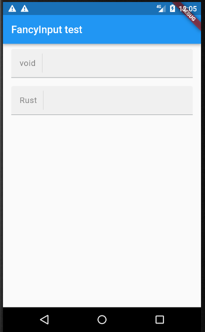
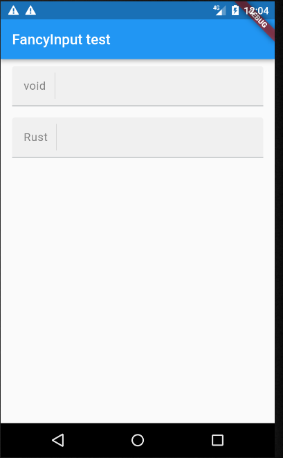

# FancyInput
Fancy and easy customizable flutter textfield

# Screenshots




# Usage

```dart

class FancyInput extends StatefulWidget {
  final Color background;
  final Color? cursorColor;
  final Color? prefixDividerColor;

  final EdgeInsets padding;
  final EdgeInsets suffixPadding;

  /* `FancyInput`'s with, by default this field is double.infinity */
  final double width;
  final bool autofocus;

  final TextEditingController? controller;

  /* Widget before the user text */
  final Widget? prefix;

  /* Widget after the user text */
  final Widget? suffix;

  /* prefix/suffix show conditions */
  final FancyInputCondition prefixShowCondition;
  final FancyInputCondition suffixShowCondition;

  /* Prefix/suffix text styles */
  final TextStyle prefixStyle;
  final TextStyle contentStyle;

  /* Input text formatters */
  final List<TextInputFormatter>? formatters;

  /* Input callbacks */
  final void Function(String)? onSubmitted;
  final void Function(String)? onChanged;

  final void Function()? onTap;
  final void Function()? onEditingComplete;

  const FancyInput({
    Key? key,
    this.background = const Color(0xffF0F0F0),
    this.padding = const EdgeInsets.symmetric(horizontal: 16, vertical: 9),
    this.suffixPadding = const EdgeInsets.symmetric(horizontal: 8),
    this.width = double.infinity,
    this.autofocus = false,
    this.controller,
    this.cursorColor,
    this.prefix,
    this.suffix,
    this.prefixDividerColor,
    this.onTap,
    this.onChanged,
    this.onSubmitted,
    this.onEditingComplete,
    this.formatters,
    this.prefixShowCondition = FancyInputCondition.alwaysShown,
    this.suffixShowCondition = FancyInputCondition.focused,
    this.prefixStyle = const TextStyle(
        fontWeight: FontWeight.w400,
        fontSize: 16,
        letterSpacing: 0.44,
        color: Color(0xff868686)),
    this.contentStyle = const TextStyle(
      color: Color(0xff333333),
      fontSize: 16,
      fontWeight: FontWeight.w400,
      letterSpacing: 0.44,
    ),
  }) : super(key: key);
}

```
