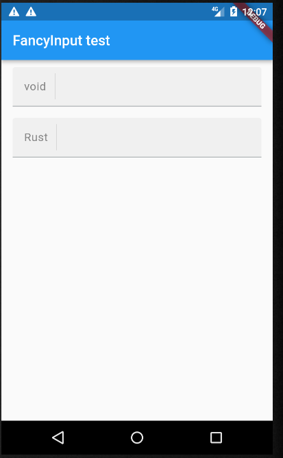
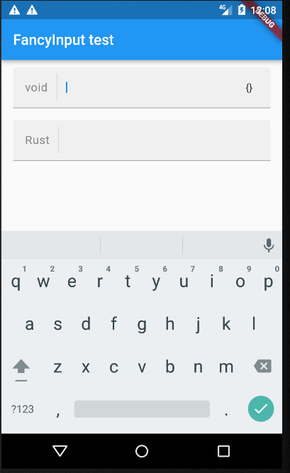

# FancyInput
Fancy and easy customizable flutter textfield

# Screenshots




# Usage

```dart

class FancyInputStyle {
  final EdgeInsets padding;

  final Color underlineColor;
  final Color dividerColor;
  final Color background;

  final Color cursorColor;
  final Color prefixColor;

  final bool onlyTopRadius;
  final bool includeDivider;

  final double borderRadius;
  final double dividerWeight;
  final double leftPrefixGap;

  final Size dividerGap;
  final Size iconSize;

  final TextStyle contentStyle;

  FancyInputStyle({
    required this.padding,
    required this.borderRadius,
    required this.dividerGap,

    required this.dividerColor,
    required this.background,
    required this.underlineColor,
    required this.prefixColor,
    required this.dividerWeight,
    required this.leftPrefixGap,
    required this.cursorColor,

    required this.contentStyle,
    required this.iconSize,

    this.onlyTopRadius = true,
    this.includeDivider = true,
  });

  FancyInputStyle.android({
    this.padding = const EdgeInsets.symmetric(vertical: 15, horizontal: 16),
    this.background = const Color(0xffF0F0F0),
    this.underlineColor = const Color.fromRGBO(38, 50, 56, 0.36),
    this.dividerColor = const Color(0xffBEBEBE),
    this.cursorColor = Colors.blue,

    this.onlyTopRadius = true,
    this.includeDivider = true,
    this.borderRadius = 4,
    this.leftPrefixGap = 0,

    this.iconSize = const Size(14, 14),

    this.contentStyle = const TextStyle(
      color: Color(0xff333333),
      fontSize: 16,
      letterSpacing: 0.44
    ),
    this.prefixColor = const Color(0xff868686),

    this.dividerGap = const Size(12, 9),
    this.dividerWeight = 1
  });

  FancyInputStyle.iOS({
    this.padding = const EdgeInsets.symmetric(vertical: 12, horizontal: 16,
    this.leftPrefixGap = 4,
    this.background = const Color(0xffF8F8F8),
    this.underlineColor = Colors.transparent,
    this.dividerColor = const Color(0xffBEBEBE),
    this.cursorColor = Colors.blue,

    this.onlyTopRadius = false,
    this.includeDivider = true,
    this.borderRadius = 18,

    this.contentStyle = const TextStyle(
      color: Color(0xff333333),
      fontSize: 24,
      letterSpacing: 0.37,
      fontFamily: '.SF UI Display'
    ),
    this.prefixColor = const Color(0xff868686),

    this.iconSize = const Size(13.35, 13.35),

    this.dividerGap = const Size(12, 10),
    this.dividerWeight = 2
  });
}

class FancyInput extends StatefulWidget {
  final FocusNode? focusNode;
  final FancyInputStyle style;

  final Widget? prefix;
  final Widget? suffix;

  final bool autofocus;
  final bool autocorrect;

  final TextEditingController? controller;

  /* Input text formatters */
  final List<TextInputFormatter>? formatters;

  /* Input callbacks */
  final void Function(String)? onSubmitted;
  final void Function(String)? onChanged;

  final void Function()? onTap;
  final void Function()? onEditingComplete;

  final void Function()? onSuffixTap;
  final bool enableSuffixFeedback;

  final IconShowCondition suffixShowCondition;

  const FancyInput({
    Key? key,

    required this.style,

    this.prefix,
    this.suffix,

    this.onChanged,
    this.onEditingComplete,
    this.onSubmitted,
    this.onSuffixTap,
    this.onTap,

    this.formatters,

    this.controller,
    this.focusNode,

    this.autocorrect = false,
    this.autofocus = false,
    this.enableSuffixFeedback = true,

    this.suffixShowCondition = IconShowCondition.focus
  }) : super(key: key);
}

```
